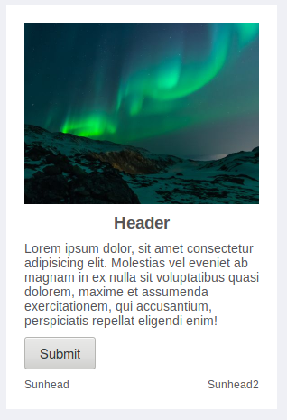
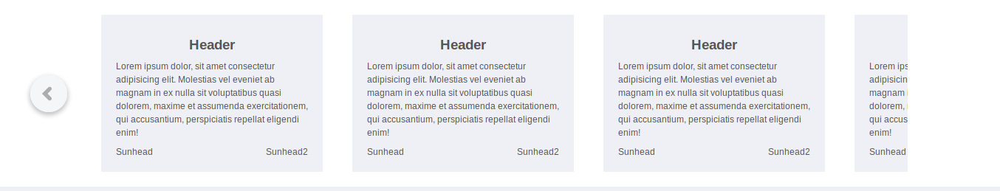

    # Components

We store all re-usable components in this folder, buttons, inputs, files, modals, loaders, etc

There are no general styles files. Every component will have its own styles file inside of it.

    --- Button
        --- 404.jsx
        --- button.card.header.style.js

    --- Cards
        --- 404.jsx
        --- cards.card.header.style.js

## List of components

# 1. button

# 2. search bar

# 3. cards and imgContainer



## How to use

```
const cardData = {
  btn: "Submit",
  img: Img,
  header: "Header",
  paragraph:  " Lorem ipsum dolor, sit amet consectetur adipisicing elit. Molestias vel eveniet ab magnam in ex nulla sit voluptatibus quasi dolorem, maxime et assumenda exercitationem, qui accusantium, perspiciatis repellat eligendi enim!",
  imgAlt: "card image",
  subHead2: "Sunhead2",
  subHead: "Sunhead",
};

```

Render like this

```html
<CardHead cardData={cardData} />
```

> ## Rules
>
> You can pass the `cardData` object in any format, but the keys must be a **_keyword_**.

Example, `cardData` can be

```
const cardData = {
  img: Img,
  btn: "Submit",
  paragraph:
  " Lorem ipsum dolor, sit amet consectetur adipisicing elit. Molestias vel eveniet ab magnam in ex nulla sit voluptatibus quasi dolorem, maxime et assumenda exercitationem, qui accusantium, perspiciatis repellat eligendi enim!",
  header: "Header",
  imgAlt: "card image",
  subHead2: "Sunhead2",
  subHead: "Sunhead",
};

```

> **Any form you create the object, you get the card. If btn comes first in you object, it will in the card.**

## props

```html
<CardHead cardData={cardData} cardImgContainerHeight="200px" />
```

- cardData,
  - the object
- cardImgContainerHeight,
  - height of the **image container**
- cardBg,
  - **background** color of the card, `default = white`
- cardPad,
  - **padding** inside the card
- cardImgHeight,
  - height of the **image** `default = 100%`
- cardObjectFit,
  - **how the image sits inside its container**, just like background pisition `default = cover`, pls for logs, use `contain`
- cardImgWidth,
  - width of the **image**
- cardHeadJustifyContent,
  - horizontal position of the **header text**.
    <!-- - cardheadAlignItems, -->
- cardHeadCol,
  - color of the **header text**
- cardParagraphWidth,
  - width of the **paragraph text**
- cardParagrapghTxtAlgin,
  - for paragraph text align `default = start`
- cardParagraphCol,
  - color of the paragraph
- cardBtnJustifyContent,
  - horizontal position of the **button**
- cardParagrapghFtSize,
  - font size of the paragraph`default = 14px`
- cardSubHeadJustifyContent,
  - horizontal position of the two subHeads `default = space-between`
- cardSubHeadFtSize,
  - font size of the **subHeads**
- cardSubHeadCol
  - color of the **subHeads**
- cardWidth
  - **Width** of the card
- cardOverlayBg
  - background color of the overlay
- cardOverlayFtSize
  - The **overlay font color**
- cardImgOpac
  - The img opacity
- cardBoxShd
  - Adds box shadow to the card. `default = none`

# 4. scroll slider



- ## How to use

  ```html
  <ScrollingDiv>
    {cardData.map(item => <Card cardData={item} />)}
  </ScrollingDiv>
  ```

  where **`<Card />`** are already designed cards given to `<ScrollingDiv />` component to render. You could also design your own cards and render them in `ScrollingDiv`.

  ## props
  - scrollOuterBg
    - This is the background color of the outer div. `default: white`
  - scrollInnerWidth
    - This is the width of the 
  - scrollInnerPad,
  - scrollCardWidth,
  - scrollCardHeight
  - scrollCardBg
  
  Example : 
  ```html
  <ScrollingDiv scrollCardBg="red">
    {cardData.map(item => <Card cardData={item} />)}
  </ScrollingDiv>
  ```

- # flexibleDiv

  ## props

  - justify-content
  - align-items:
  - flex-wrap:
  - flex-direction:

- # gridableDiv
  - grid-template-columns:
  - grid-template-rows
  - grid-gap: \${props
    <!-- * # date and time picker -->
- # modals
- # progress bar
- # popover
- # textarea
- # paginator
  - # see more paginatior
- # rating
- # skeleton
- # table
